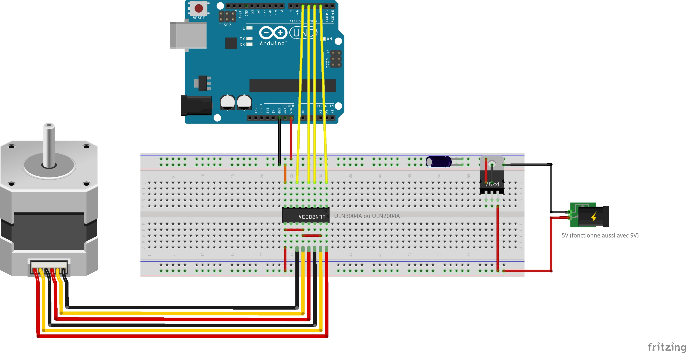

#Schweppes2Feeder
================
*But  : Créer un système permettant de nourrir automatiquement Schweppes II.

Dans un premier temps, le système lui fournira sa dose quotidienne de pétales bizarres de nourriture de poisson chaque jours à 9h.

*Schéma du prototype : 

